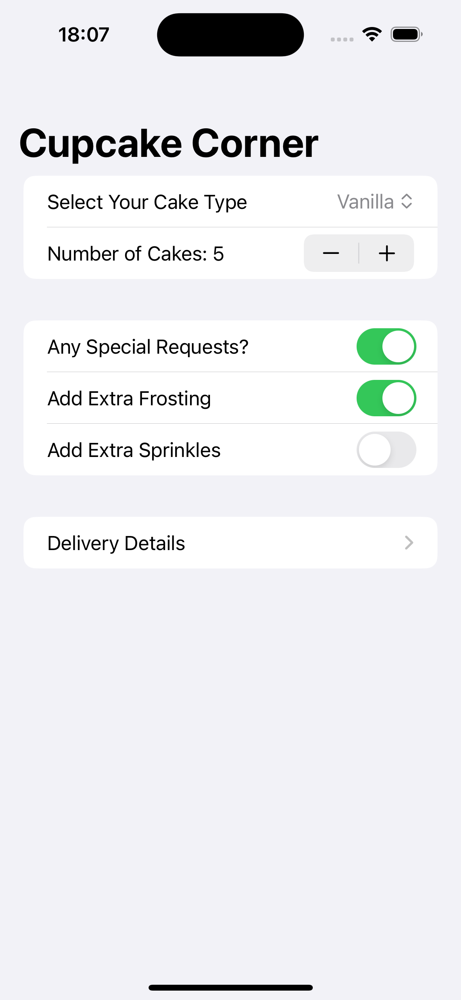
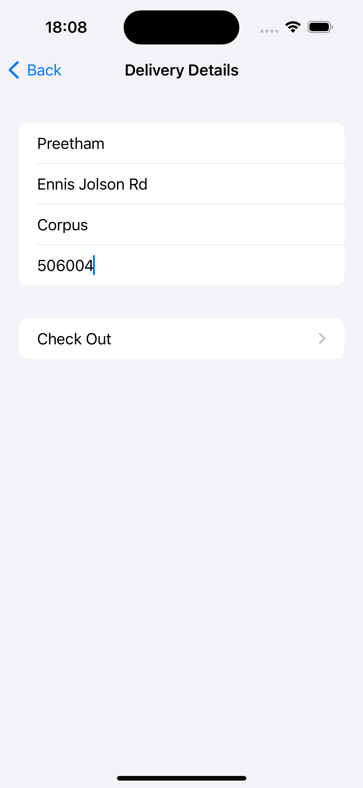
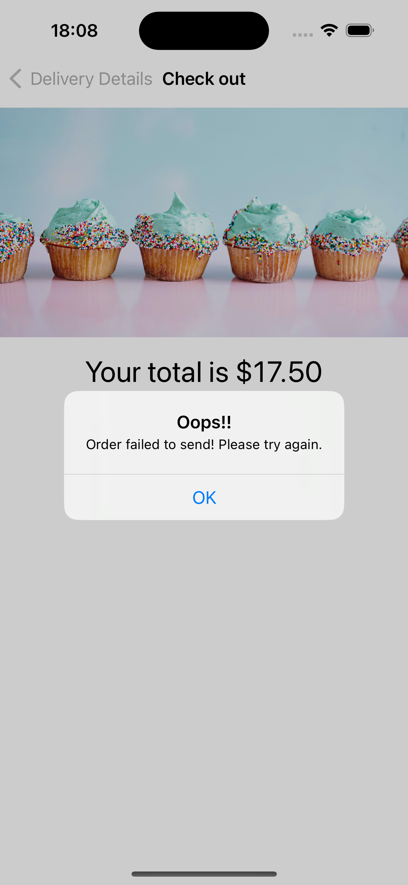

# CupcakeCorner

CupcakeCorner is an iOS application that allows users to order delicious cupcakes with various customizations and delivery options. This project demonstrates the use of SwiftUI for building user interfaces, along with async/await for handling asynchronous network requests.

## Features

- **Select Cake Type:** Users can choose from a variety of cupcake types.
- **Quantity Selector:** Users can specify the number of cupcakes they want to order.
- **Special Requests:** Options for extra frosting and sprinkles.
- **Delivery Details:** Users can enter their delivery information including name, address, city, and zip code.
- **Order Confirmation:** Users receive an order confirmation message after placing an order.

## Screenshots

## Requirements

- iOS 14.0+
- Xcode 13.0+
- Swift 5.5+

## License

This project is licensed under the MIT License - see the [LICENSE](LICENSE.md) file for details.
